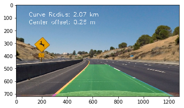

# Advanced Lane Finding

The Project
---

The goals / steps of this project are the following:

* Compute the camera calibration matrix and distortion coefficients given a set of chessboard images.
* Apply a distortion correction to raw images.
* Use color transforms, gradients, etc., to create a thresholded binary image.
* Apply a perspective transform to rectify binary image ("birds-eye view").
* Detect lane pixels and fit to find the lane boundary.
* Determine the curvature of the lane and vehicle position with respect to center.
* Warp the detected lane boundaries back onto the original image.
* Output visual display of the lane boundaries and numerical estimation of lane curvature and vehicle position.

[Rubric Points](https://review.udacity.com/#!/rubrics/476/view)

[//]: # (Image References)

[image1]: ./Images/Undistorted_Image.jpg "undistorted" 
[image2]: ./Images/chessboard.png "chessboard"
[image3]: ./Images/img_dist.png "image_distortion"
[image4]: ./Images/color_channels.png "color_channels"
[image5]: ./Images/threshold_masked.png "threshold_masked"
[image6]: ./Images/mag.png "mag_thresh"
[image7]: ./Images/Transformation.png "warp-TransformationImage"
[image8]: ./Images/warped_lines.jpg "warped lines"
[image9]: ./Images/warped_img.png "warped Image"
[image10]: ./Images/finding_lines.png "finding lines"
[image11]: ./Images/final_infos.png "Flipped Image"
[image12]: ./Images/sobel.png "sobel"
[image13]: ./Images/dir.png "dir Image"
[image14]: ./Images/s_channel.png "Flipped Image"

Camera Calibration
---

#### 1. Have the camera matrix and distortion coefficients been computed correctly and checked on one of the calibration images as a test?

The code for this step is [here](https://github.com/BY571/Camera-Calibration/blob/master/Camera%20Calibration.ipynb).

I start by preparing "object points", which will be the (x, y, z) coordinates of the chessboard corners in the
world. Here I am assuming the chessboard is fixed on the (x, y) plane at z=0, such that the object points are
the same for each calibration image. Thus, objp is just a replicated array of coordinates, and objpoints
will be appended with a copy of it every time I successfully detect all chessboard corners in a test image.
imgpoints will be appended with the (x, y) pixel position of each of the corners in the image plane with
each successful chessboard detection.

![image2]

I then used the output objpoints and imgpoints to compute the camera calibration and distortion coefficients using the cv2.calibrateCamera() function. I applied this distortion correction to the test
image using the cv2.undistort() function and obtained this result ([code](https://github.com/BY571/Camera-Calibration/blob/master/Correcting%20for%20Distortion.ipynb)):

![image1]

# Pipeline

The first step in my pipeline is undistorting the input image with the objectpoints and imagepoints from the previous camera calibration.

![image3]

## Creating a binary image through thresholding

Afterwards a binary image is created by using differend methods like color thresholding, gradients et cetera.
For color thresholding I examined different color channels...

![image4]

In my final pipeline I use R & G thresholds so that yellow lanes are detected well. Furthermore I decided to implement the 
s-channel of the hls image and the l-channel of the lab image. In combination that makes a pretty good color threshold.
![image14]
As color threshold there has also been sobel (x,y) gradients implemented (line 91-104), as well as a function for the gradient magnitude (line 75-89) and a function for the gradient direction (line 106-117) .

![image12]
![image6]
![image13]

Finally the output binary got masked for focussing on the essential informations and preserve for possible and irrelevant destructions. 
The final output looks like this:

![image5]

## Warping to bird perspective

To prepare warping the image I searched for the optimal source and destination points (line 130-139). I tried different combination on all test images. 

![image8]

The final transformation is in line 119-148 of the code and its output for a binary, masked image looks like this: 

![image9]

## Window Search

The next step in my piple is finding the lane lines. This is done by a window search on the binary and transformed image, whereby a histogram function is spotting the light spots on the image. The highest amplitudes indicate the positions of both lines (line 150-226).
The output of the window search look like this:

![image10]

## Back Transformation

The last step is to back transform the image from bird perspective to regular perspective (line 258-278). For information purposes the road curvature (line 229-245 ) and the center offset (line 247-256 ) by the car are calculated and also represented on the final output image of the pipeline.

![image11]

## Pipeline (Video)

## Discussion

- while applying the pipeline on the challenge video I noticed that shadows represent still a problem. The goal is to fix this problem through various methods.
- another mark is to implement a Line Class to also make the pipleine more robust.

